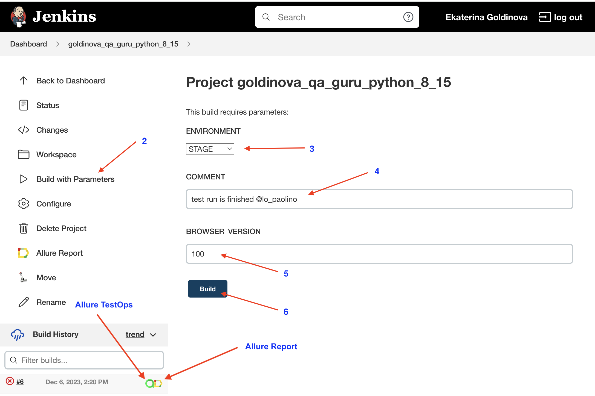

## Проект по тестированию карточек товаров на тестовом магазине Swag Labs

> <a target="_blank" href="https://www.saucedemo.com">Swag Labs</a>

#### Список проверок, реализованных в авто-тестах

- [x] Логин стандартного пользователя (Вынесен в фикстуру так как без логина невозможны любые действия на сайте)
- [x] Проверка заполнения карточек товара (7 штук)
- [ ] Покупка товара

### Проект реализован с использованием:

  <code></code>
  <code></code>
  <code></code>
  <code></code>
  <code></code>
  <code></code>
  <code></code>
  <code></code>
  <code></code>
  <code></code>
  <code></code>

### Запуск автотестов выполняется на сервере Jenkins
> <a target="_blank" href="https://jenkins.autotests.cloud/job/goldinova_qa_guru_python_8_15/">Ссылка на проект в Jenkins</a>

### Параметры сборки

* `ENVIRONMENT` - определяет окружение для запуска тестов, по умолчанию STAGE
* `COMMENT` - комментарий к сборке
* `BROWSER_VERSION` - желаемая версия браузера Google Chrome, по умолчанию 100

#### Для запуска автотестов в Jenkins

1. Открыть <a target="_blank" href="https://jenkins.autotests.cloud/job/goldinova_qa_guru_python_8_15/">проект</a>
2. Выбрать пункт `Build with Parameters`
3. Выбрать окружение в выпадающем списке ENVIRONMENT
4. Указать комментарий в поле COMMENT
5. Указать версию браузера в поле BROWSER_VERSION
6. Нажать кнопку `Build`
